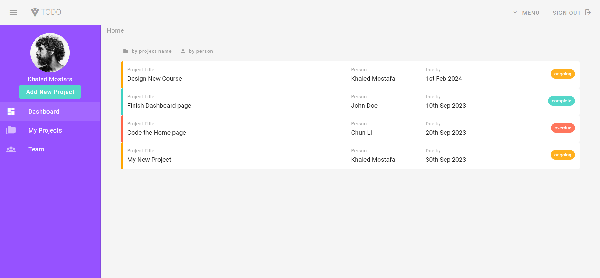
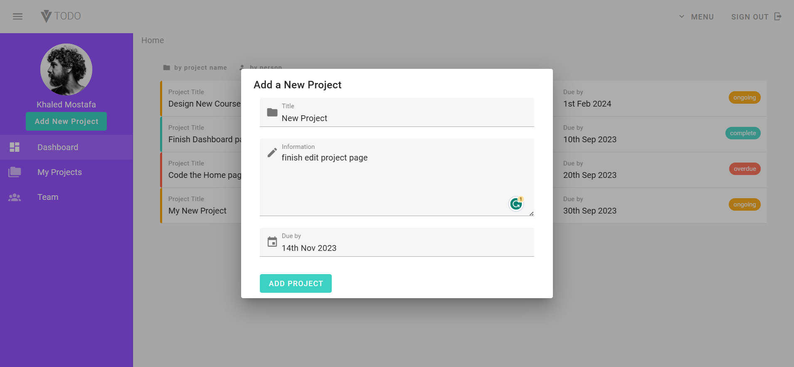
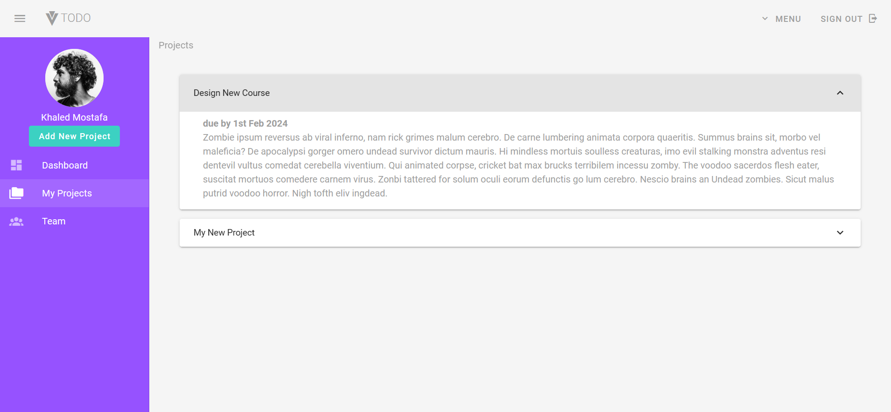
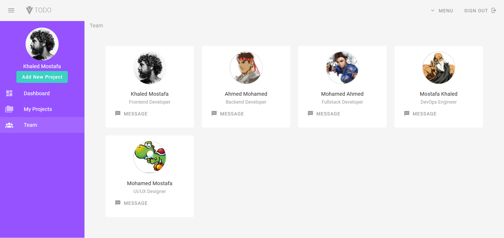

<h1 align="center"><span style="display:flex; justify-content:center; align-items:center;">TODO</span></h1>

## Table of Contents

- [Table of Contents](#table-of-contents)
- [👋Introduction](#introduction)
- [🌟Features](#features)
- [🚀 Live Demo](#-live-demo)
- [📸 Screenshots](#-screenshots)
  - [📊 Dashboard Page](#-dashboard-page)
  - [🆕 Create New Project](#-create-new-project)
  - [📁 My Projects Page](#-my-projects-page)
  - [👥 Team Page](#-team-page)
- [🛠️Technologies Used](#️technologies-used)
- [🏁Getting Started](#getting-started)
- [⬇️Installation](#️installation)
- [🔧Usage](#usage)
- [📄License](#license)

## 👋Introduction

Vuetify Todo is a project management application that allows users to create, edit, and view details of their projects. The application is designed to be fully responsive, ensuring that users can access their projects from any device.

With Vuetify Todo, users can easily create new projects, assign team members to each project, and set deadlines for each task. The application also includes a dashboard that provides an overview of all active projects, making it easy to track progress and stay on top of deadlines.

## 🌟Features

- Create new projects
- Edit existing projects
- View details of projects
- Assign team members to projects
- Set deadlines for tasks
- Dashboard for overview of active projects

## 🚀 Live Demo

[vuetify-todo](https://world-wise-ts.netlify.app/)

## 📸 Screenshots

### 📊 Dashboard Page



### 🆕 Create New Project



### 📁 My Projects Page



### 👥 Team Page



## 🛠️Technologies Used

The Vuetify Todo project utilizes the following technologies:

-  &nbsp; &nbsp;[Vue](https://vuejs.org/)

-  &nbsp; &nbsp;[Vuetify](https://vuetifyjs.com/)

-  &nbsp; &nbsp; [Firebase](https://firebase.google.com/)

- Vue Router

## 🏁Getting Started

To set up the Vuetify Todo project locally, follow the instructions below.

## ⬇️Installation

1. Clone the repository:

   ```bash
   git clone https://github.com/khaled-farahat/vuetify-todo.git
   cd vuetify-todo
   ```

1. Install the dependencies:

   ```bash
   npm install
   ```

## 🔧Usage

1. Run the development server:

   ```bash
   npm run dev
   ```

1. Open your browser and navigate to [http://localhost:8080/](http://localhost:8080/) to access Vuetify Todo application.


## 📄License

The vuetify-todo project is open-source and is licensed under the [MIT License](LICENSE) .
